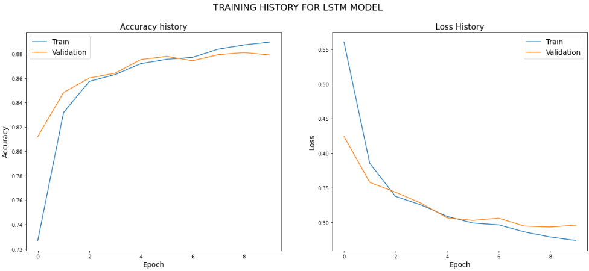

# Portfolio

---

## Regression and Classification Projects

### [Credit Card Payment Classification](/credit-card-classification)

---

### [Used Cards Price Prediction](/used-cars-price-prediction)

---

## NLP Projects

### [NLP POS-Tagging](/pos-tagging)

---

### [NLP Sentiment Analysis](/sentiment-analysis)

---

### [NLP Word2Vec Analogies](/analogies)

---

## Category Name 2

- [Project 1 Title](http://example.com/)
- [Project 2 Title](http://example.com/)
- [Project 3 Title](http://example.com/)
- [Project 4 Title](http://example.com/)
- [Project 5 Title](http://example.com/)

---

---

Page template forked from <a href="https://github.com/evanca/quick-portfolio">evanca</a>

<!-- Remove above link if you don't want to attibute -->
